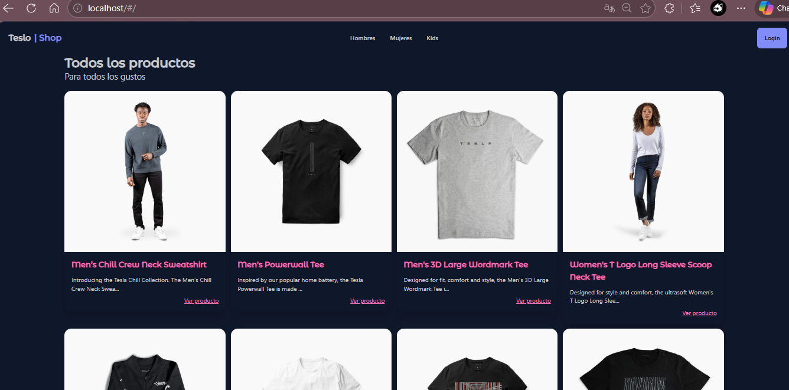
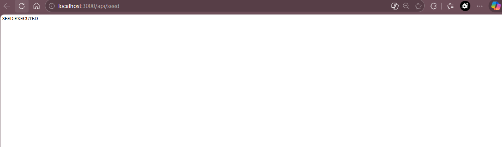

# tesloshop-app

## Paso 1: Dockerfile del backend (NestJS)

Creamos un Dockerfile especial para el backend. ¿Por qué tiene varias etapas? Porque así podemos tener:

- **Una imagen ligera para producción**: solo lo necesario para que la app funcione.
- **Un entorno de desarrollo con recarga automática**: cuando cambias el código, el servidor se reinicia solo.

### Etapas explicadas fácil:

1. **dev** – aquí se monta el código en vivo y se ejecuta con `yarn start:dev` para que puedas programar viendo los cambios al instante.
2. **dev-deps** – instala todas las dependencias las que se usan en desarrollo y en producción.
3. **builder** – compila el código TypeScript a JavaScript el resultado queda en la carpeta `dist`.
4. **prod-deps** – instala **solo** las dependencias necesarias para producción sin herramientas de desarrollo.
5. **prod** – toma el código compilado (`dist`) y las dependencias de producción y genera una imagen final pequeña y segura, lista para desplegar.

## Paso 2: Dockerfile del frontend (Angular + Nginx)

- **Dos etapas**:  
  1. `build`: compila Angular con Node.  
  2. `runtime`: sirve los archivos con Nginx (imagen pequeña).

- **Optimización**: primero copiamos `package*.json` y ejecutamos `npm ci`. Si el `package.json` no cambia, Docker reutiliza esa capa y la construcción es más rápida.

- **Ruta**: Angular 17+ genera los archivos en `dist/teslo-shop/browser`.

---

## Paso 3: `nginx.conf`

- **Proxy a la API**: Nginx redirige `/api` y `/socket.io` al backend (`http://backend:3000`).
- **Sin CORS**: El navegador solo habla con Nginx (mismo origen). Nginx reenvía internamente al backend, así que no hay peticiones cross‑origin y no se necesita configurar CORS.

## Paso 4: Variables de entorno

- Copia `.env.example` a `.env` y edita los valores reales (contraseñas, JWT_SECRET).
- Reglas importantes:
  - `DB_HOST=db` (nombre del servicio en Compose)
  - `DB_PASSWORD` debe ser igual a `POSTGRES_PASSWORD`
  - `STAGE=dev` para desarrollo con recarga automática
- `.env` no se sube a GitHub (está en `.gitignore`).

## Paso 5: docker-compose.yml

Este archivo estan los tres servicios que forman la aplicación:

- **db**: PostgreSQL. Usa la imagen oficial de Docker Hub. Incluye un `healthcheck` para asegurar que la base de datos para saber si esta lista antes de que el backend intente conectarse.
- **backend**: NestJS. Construye la imagen desde `teslo-shop/Dockerfile` usando la etapa definida en `STAGE` (desarrollo `dev`). Depende de `db` en estado saludable.
- **frontend**: Angular + Nginx. Construye desde `angular-tesloshop/Dockerfile`. Depende del backend esta se inicia despues.

**Red**: todos los servicios están conectados a la red interna `teslo-network`, lo que permite que se comuniquen usando el nombre del servicio como por ejemplo, `db`, `backend`.  
**Volumen**: `postgres-data` guarda los datos de la base de datos fuera del contenedor, para que no se pierdan al reiniciar.  
**Variables**: todos los valores sensibles como las contraseñas, puertos, etc. Se toman del archivo `.env`, que no se sube a GitHub.

## Paso 6: Scripts de arranque y parada

Se crearon dos scripts para facilitar la gestión:

- `start.sh`: verifica que Docker esté corriendo, construye las imágenes y levanta los contenedores en segundo plano.
- `stop.sh`: detiene y elimina los contenedores y la red, pero **conserva los datos** de la base de datos en el volumen `postgres-data`.

**Diferencias**:

`docker compose down` hace que se detiene y elimina contenedores y red. Los datos de Postgres se conservan. 
`docker compose down -v` Lo que hace es que elimina los volúmenes (los datos de la BD se pierden). Útil para cuando se hace un reset total.

## Paso 7 — Ejecutar todo por primera vez

En este paso se pone en marcha la aplicación completa. Se verifica que Docker esté listo, se configuran las variables de entorno y se levantan los contenedores con Docker Compose.

### 10.1 Verificar que Docker está instalado y activo

Ejecutamos los siguientes comandos para asegurarnos de que Docker y Docker Compose están disponibles:

jose_ruiz@DESKTOP-21FUFD0:~/tesloshop$ docker --version
Docker version 28.2.2, build 28.2.2-0ubuntu1~24.04.1
jose_ruiz@DESKTOP-21FUFD0:~/tesloshop$ docker compose version
Docker Compose version v5.1.0

### 10.4 Lanzar la aplicación (opción B)

Se utilizó el comando directo de Docker Compose:
docker compose up --build -d
Dando como resultado:
[+] up 14/14
 ✔ Image postgres:14.3 Pulled                                                                   44.7s
[+] Building 392.8s (29/29) FINISHED

[+] up 21/21king to docker.io/library/tesloshop-backend:latest                                101.0s 
 ✔ Image postgres:14.3             Pulled                                                      44.7s 
                                       377.8s
 ✔ Network tesloshop_teslo-network Created                                                     0.2s  
 ✔ Volume tesloshop_postgres-data  Created                                                     0.0s  
 ✔ Container teslo-db              Healthy                                                     44.0s 
 ✔ Container teslo-backend         Started                                                     42.4s 
 ✔ Container teslo-frontend        Started   

 ## Sección 10.5 Verificar que los servicios están corriendo
 Con el comando:

docker compose ps

Esto fue lo que se mostro:
jose_ruiz@DESKTOP-21FUFD0:~/tesloshop$ docker compose ps
NAME             IMAGE                COMMAND                  SERVICE    CREATED          STATUS                    PORTS
teslo-backend    tesloshop-backend    "docker-entrypoint.s…"   backend    21 minutes ago   Up 21 minutes             0.0.0.0:3000->3000/tcp, [::]:3000->3000/tcp
teslo-db         postgres:14.3        "docker-entrypoint.s…"   db         21 minutes ago   Up 21 minutes (healthy)   0.0.0.0:5432->5432/tcp, [::]:5432->5432/tcp
teslo-frontend   tesloshop-frontend   "/docker-entrypoint.…"   frontend   21 minutes ago   Up 20 minutes             0.0.0.0:80->80/tcp, [::]:80->80/tcp

Como se ve, los tres contenedores están en estado Up y la base de datos aparece como healthy, lo que indica que el healthcheck configurado en docker-compose.yml funciona correctamente.

### 10.6 Revisar logs

Para confirmar que no hubo errores, se pueden inspeccionar los logs de cada servicio:

docker compose logs -f backend   # ver logs del backend
docker compose logs -f db        # ver logs de la base de datos

**Ejecución real desde la terminal:**

Se usa el comando:
jose_ruiz@DESKTOP-21FUFD0:~/tesloshop$ curl http://localhost:3000/api/seed
Aparecio seed executed

Imagenes de que funciono:

```markdown

